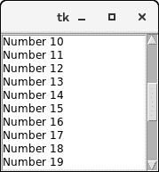

# python tkinter scroll bar(python tkinter 卷轴)


滚动条小部件用于向下滚动其他小部件的内容，如列表框、文本和画布。然而，我们也可以为入口小部件创建水平滚动条。

下面给出了使用滚动条小部件的语法。

### 句法

```py

w = Scrollbar(top, options) 

```

下面列出了可能的选择。

| 塞内加尔 | [计]选项 | 描述 |
| one | 活动背景 | 小部件具有焦点时的背景颜色。 |
| Two | 锥齿轮 | 小部件的背景色。 |
| three | 弹底引信（base detonating 的缩写） | 小部件的边框宽度。 |
| four | 命令 | 它可以设置为与列表相关联的过程，每次移动滚动条时都可以调用该过程。 |
| five | 光标 | 鼠标指针变为设置为该选项的光标类型，可以是箭头、点等。 |
| six | elemontborderwidth | 它表示箭头和滑块周围的边框宽度。默认值为-1。 |
| seven | 高亮背景 | 当小部件没有焦点时，焦点会高亮显示。 |
| eight | 高亮颜色 | 当小部件具有焦点时，焦点高度高亮。 |
| nine | 高光厚度 | 它表示焦点高光的厚度。 |
| Ten | 跳跃 | 它用于控制滚动跳转的行为。如果设置为 1，则当用户释放鼠标按钮时，调用回调。 |
| Eleven | 东方 | 根据滚动条的方向，它可以设置为水平或垂直。 |
| Twelve | 反复地 | 此选项告知在滑块开始向该方向重复移动之前，按钮将被按下的持续时间。默认值为 300 ms。 |
| Thirteen | 重复服务器 | 重复间隔的默认值是 100。 |
| Fourteen | 聚焦 | 默认情况下，我们可以通过这个小部件来标记焦点。如果我们不想要这种行为，可以将此选项设置为 0。 |
| Fifteen | troughcolor | 它代表槽的颜色。 |
| Sixteen | 宽度 | 它表示滚动条的宽度。 |

## 方法

该小部件提供以下方法。

| 塞内加尔 | 方法 | 描述 |
| one | get() | 它返回代表滚动条当前位置的两个数字 a 和 b。 |
| Two | 设置(第一个，最后一个) | 它用于将滚动条连接到另一个小部件上。 |

### 例子

```py

from tkinter import *

top = Tk()
sb = Scrollbar(top)
sb.pack(side = RIGHT, fill = Y)

mylist = Listbox(top, yscrollcommand = sb.set )

for line in range(30):
    mylist.insert(END, "Number " + str(line))

mylist.pack( side = LEFT )
sb.config( command = mylist.yview )

mainloop()

```

**输出:**

