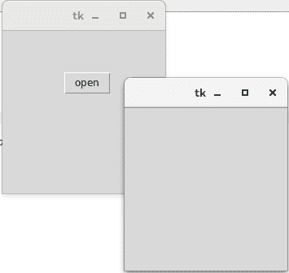

# Tkinter 顶层


顶层小部件用于创建和显示由窗口管理器直接管理的顶层窗口。顶层小部件的顶部可能有也可能没有父窗口。

当 python 应用需要在新窗口上表示一些额外的信息、弹出窗口或一组小部件时，使用顶层小部件。

顶层窗口有标题栏、边框和其他窗口装饰。

下面给出了使用顶层小部件的语法。

### 句法

```py

w = Toplevel(options) 

```

下面列出了可能的选择。

| 塞内加尔 | 选择 | 描述 |
| one | 锥齿轮 | 它表示窗口的背景色。 |
| Two | 弹底引信（base detonating 的缩写） | 它表示窗口的边框大小。 |
| three | 光标 | 鼠标指针变为设置为箭头、点等的光标类型。当鼠标在窗口中时。 |
| four | 班级 _ | 在文本小部件中选择的文本被导出到窗口管理器。我们可以将该值设置为 0，使该行为为假。 |
| five | 字体 | 插入小部件的文本的字体类型。 |
| six | 细粒 | 小部件的前景色。 |
| seven | 高度 | 它表示窗口的高度。 |
| eight | 减轻 | 它表示窗口的类型。 |
| nine | 宽度 | 它表示窗口的宽度， |

## 方法

下面的列表给出了与顶层小部件相关的方法。

| 塞内加尔 | 方法 | 描述 |
| one | 神化() | 此方法用于显示窗口。 |
| Two | 框架() | 它用于显示系统相关的窗口标识符。 |
| three | 组(窗口) | 它用于将此窗口添加到指定的窗口组中。 |
| four | iconify() | 它用于将顶层窗口转换为图标。 |
| five | 协议(名称、功能) | 它用于提及将为特定协议调用的功能。 |
| six | 状态() | 它用于获取窗口的当前状态。可能的值有正常、图标、撤回和图标。 |
| seven | 瞬态([主]) | 它用于将该窗口转换为临时窗口。 |
| eight | 撤回() | 它用于删除窗口，但不会破坏它。 |
| nine | 最大尺寸(宽度、高度) | 它用于声明窗口的最大大小。 |
| Ten | 最小化(宽度、高度) | 它用于声明窗口的最小大小。 |
| Eleven | (世卫组织)职位 | 它用于定义位置控制器。 |
| Twelve | 可调整大小(宽度、高度) | 它用于控制窗口是否可以调整大小。 |
| Thirteen | 大小来自(世卫组织) | 它用于定义尺寸控制器。 |
| Fourteen | 标题(字符串) | 它用于定义窗口的标题。 |

### 例子

```py

from tkinter import *

root = Tk()

root.geometry("200x200")

def open():
    top = Toplevel(root)
    top.mainloop()

btn = Button(root, text = "open", command = open)

btn.place(x=75,y=50)

root.mainloop()

```

**输出:**

