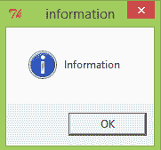
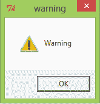
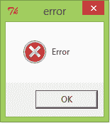
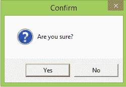
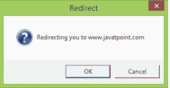
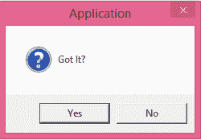
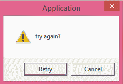

# Tkinter 消息框


messagebox 模块用于在 python 应用中显示消息框。根据应用要求，有多种功能用于显示相关消息。

下面给出了使用消息框的语法。

### 句法

```py

messagebox.function_name(title, message [, options])

```

### 因素

*   **功能 _ 名称:**代表一个合适的消息框功能。
*   **标题:**是一个字符串，显示为消息框的标题。
*   **消息:**是在消息框中显示为消息的字符串。
*   **选项:**有多种选项可用于配置消息对话框。

可以使用的两个选项是默认选项和父选项。

**1。默认**

默认选项用于提及默认按钮的类型，即消息框中的 ABORT、RETRY 或 IGNORE。

**2。母公司**

父选项指定要在其上显示消息框的父窗口。

以下功能之一用于显示适当的消息框。所有函数都使用相同的语法，但具有特定的功能。

### 1.showinfo()

showinfo()消息框用于我们需要向用户显示一些相关信息的地方。

### 例子

```py

# !/usr/bin/python3

from tkinter import *

from tkinter import messagebox

top = Tk()

top.geometry("100x100")    

messagebox.showinfo("information","Information")

top.mainloop()

```

**输出:**



### 2.showwarning()

此方法用于向用户显示警告。考虑下面的例子。

### 例子

```py

# !/usr/bin/python3
from tkinter import *

from tkinter import messagebox

top = Tk()
top.geometry("100x100")
messagebox.showwarning("warning","Warning")

top.mainloop()

```

**输出:**



### 3.showerror()

此方法用于向用户显示错误消息。考虑下面的例子。

### 例子

```py

# !/usr/bin/python3
from tkinter import *
from tkinter import messagebox

top = Tk()
top.geometry("100x100")
messagebox.showerror("error","Error")
top.mainloop()

```

**输出:**



### 4.askquestion()

这种方法用于向用户提出一些问题，这些问题可以用是或否来回答。

### 例子

```py

# !/usr/bin/python3
from tkinter import *
from tkinter import messagebox

top = Tk()
top.geometry("100x100")
messagebox.askquestion("Confirm","Are you sure?")
top.mainloop()

```

**输出:**



### 5.askokcancel()

此方法用于确认用户对某些应用活动的操作。考虑下面的例子。

### 例子

```py

# !/usr/bin/python3
from tkinter import *
from tkinter import messagebox

top = Tk()
top.geometry("100x100")
messagebox.askokcancel("Redirect","Redirecting you to www.javatpoint.com")
top.mainloop()

```

**输出:**



### 6.askyesno()

这个方法用来询问用户某个动作，用户可以回答是或不是。

### 例子

```py

# !/usr/bin/python3
from tkinter import *
from tkinter import messagebox

top = Tk()
top.geometry("100x100")
messagebox.askyesno("Application","Got It?")
top.mainloop()

```

**输出:**



### 7.askretrycancel()

这种方法用于询问用户是否再次执行特定任务。考虑下面的例子。

### 例子

```py

# !/usr/bin/python3
from tkinter import *
from tkinter import messagebox

top = Tk()
top.geometry("100x100")
messagebox.askretrycancel("Application","try again?")

top.mainloop()

```

**输出:**

