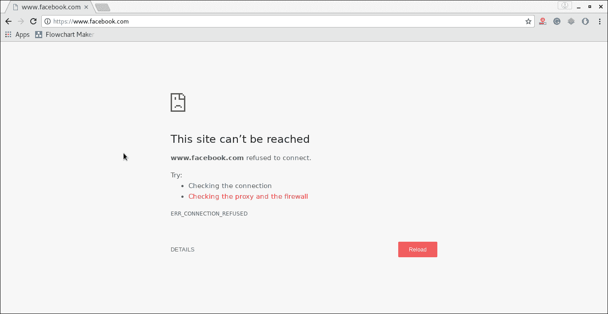

# 介绍

> 原文：<https://www.javatpoint.com/python-website-blocker>

在教程的这一部分，我们将构建一个实时最流行的 python 应用，称为网站拦截器。

此应用可用于阻止网站，以便用户在特定时间段内无法打开它们。

Let's discuss how can we build such an application by using python.

## 目标

Python 网站拦截器的目标是拦截某些特定的网站，这些网站可以在指定的时间内分散用户的注意力。

在这种情况下，我们将在工作时间阻止访问某些特定网站的列表，以便用户只能在空闲时间访问这些网站。

这个 python 应用中的工作时间被认为是从上午 9 点到下午 5 点。除此之外的时间段将被视为空闲时间。

## 过程

为了阻止对计算机上特定网站的访问，我们需要配置**主机**文件。

### 主机文件

主机文件是一个本地文件，在过去用于将主机名映射到 IP 地址。虽然现在使用 DNS 服务将主机名映射到 IP 地址，但是主机文件仍然非常复杂，可以用来在本地配置 IP 地址的映射。

### 主机文件的位置

主机文件的位置因操作系统而异。

**Windows:**C:\ Windows \ System32 \驱动程序\等

**mac 和 Linux:**/etc/主机

## 配置

由于 hosts 文件包含主机名和 IP 地址之间的映射，让我们来看看我们的 hosts 文件的内容，当我们使用 CentOS 7 (Linux)时，它首先存储为 **/etc/hosts** 。


从上图中我们可以看到，这些映射是为 IP 地址为 127.0.0.1 的本地主机保存的。

同样，我们可以将任何主机名重定向回本地主机 IP (127.0.0.1)。它将阻止对该主机名的访问，并在每次请求时将其重定向到 localhost。

为了证明，让我们编辑 hosts 文件的内容，并在其中添加以下几行。要更改 **/etc/hosts** 文件，我们需要更改其权限。

在终端上运行以下命令来更改权限。

```py

$ sudo chmod 777 /etc/hosts 

```

现在在文件中添加以下一行来阻止对 facebook.com 的访问(例如)。

```py

127.0.0.1		www.facebook.com 

```

如下图所示。


保存文件，并尝试使用浏览器打开 www.facebook.com。



如上图所示，拒绝连接。

我们已经通过手动编辑主机文件完成了任务。我们还没有达到目标。我们的目标是仅在工作时间(上午 9 点到下午 5 点)阻止访问某些特定网站(例如 facebook)。

它需要一个 python 脚本，在特定时期不断向 hosts 文件添加必要的行。

在教程的这一部分，我们将构建这样一个 python 脚本，它可以在工作时间编辑 hosts 文件。我们还将在操作系统启动时部署该脚本，这样它就不需要任何外部执行。

## 要求

我们需要知道以下 python 模块来构建 python 网站拦截器。

1.  **文件处理:**文件处理用于对主机文件进行修改。
2.  **时间:**时间模块用于控制修改主机文件的频率。
3.  **datetime:**datetime 模块用于跟踪空闲时间和工作时间。