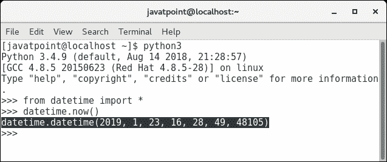
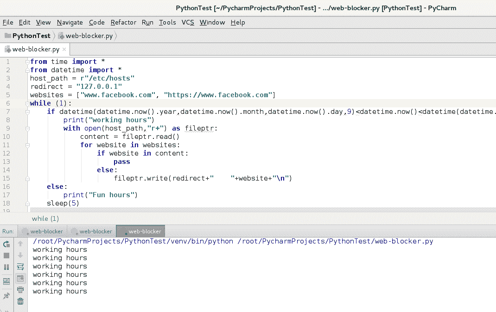

# 构建 python 脚本

> 原文：<https://www.javatpoint.com/python-website-blocker-building-python-script>

让我们开始构建可以在系统启动时运行的 python 脚本，以阻止对特定网站的访问。打开 PyCharm 编辑代码，或者您可以使用任何您想要的 IDE。

创建一个名为**网页拦截器的新 Python 脚本。为了让您理解这个过程，我们将逐步构建这个脚本。所以让我们从设置所有需要的变量开始编码。**

## 设置变量

此步骤初始化将在脚本中使用的所有必需变量。这里，host_path 被设置为 hosts 文件的路径。在我们的案例中，它位于 **/etc** 下。在 python 中，r 用于表示原始字符串。

**重定向**被分配到本地主机地址，即 127.0.0.1。**网站**是一个列表，其中包含要被阻止的网站列表。

```py
host_path = r"/etc/hosts"
redirect = "127.0.0.1"
websites = ["www.facebook.com", "https://www.facebook.com"]

```

## 设置无限循环

我们需要在 python 脚本中有一个 while 循环，以确保我们的脚本每 5 秒运行一次。

为了实现这一点，我们将使用时间模块的 sleep()方法。

```py
import time

host_path = r"/etc/hosts"
redirect = "127.0.0.1"
websites = ["www.facebook.com", "https://www.facebook.com"]

while True:
    time.sleep(5)

```

## 确定时间

在构建我们想要的 python 脚本的过程中，我们需要检查当前时间是工作时间还是娱乐时间，因为应用会在工作时间阻止网站访问。

为了检查当前时间，我们将使用 datetime 模块。我们将检查 datetime.now()是否大于当前日期上午 9 点的 datetime 对象，并且小于当前日期下午 5 点的 datetime 对象。

让我们进一步讨论 datetime.now()的输出。



它返回一个 datetime 对象，包含当前时间，包括年(2019 年)、月(1 月 1 日 <sup>st</sup> )、日期(23 日)、时间(小时、分钟、秒)。我们可以比较该值，并使用 if 语句检查该值是否存在于当前日期的上午 9 点和当前日期的下午 5 点之间。

该脚本现在将包含以下代码。

```py
from time import *
from datetime import *

host_path = r"/etc/hosts"
redirect = "127.0.0.1"
websites = ["www.facebook.com", "https://www.facebook.com"]

while True:
    if datetime(datetime.now().year,datetime.now().month,datetime.now().day,9)< datetime.now()< datetime(datetime.now().year,datetime.now().month,datetime.now().day,17):
        print("Working hours")

    else:
        print("Fun hours")
    sleep(5)

```

## 写入主机文件

该脚本的主要目标是保持定期修改主机文件。为了让脚本配置主机文件，我们需要在这里实现文件处理方法。

下面的代码被添加到主机文件中。

```py
with open(host_path,"r+") as fileptr:
            content = fileptr.read()
            for website in websites:
                if website in content:
                    pass
                else:
                    fileptr.write(redirect+"
					"+website+"\n")

```

open()方法在 r+模式下打开存储为 host_path 的文件。首先，我们使用 read()方法读取文件的所有内容，并将其存储到名为 content 的变量中。

for 循环遍历网站列表(网站)，我们将检查列表中的每个项目是否已经存在于内容中。

如果它存在于主机文件内容中，那么我们必须通过。否则，我们必须将重定向网站映射写入 hosts 文件，以便将网站主机名重定向到 localhost。

hosts 文件现在将包含以下 python 代码。

```py
from time import *
from datetime import *
host_path = r"/etc/hosts"
redirect = "127.0.0.1"
websites = ["www.facebook.com", "https://www.facebook.com"]
while True:
    if datetime(datetime.now().year,datetime.now().month,datetime.now().day,9)<datetime.now()<datetime(datetime.now().year,datetime.now().month,datetime.now().day,17):
        print("working hours")
        with open(host_path,"r+") as fileptr:
            content = fileptr.read()
            for website in websites:
                if website in content:
                    pass
                else:
                    fileptr.write(redirect+"    "+website+"\n")
    else:
        print("Fun hours")
    sleep(5)

```

现在，让我们运行这个 python 脚本，检查它是否修改了 hosts 文件。



如我们所见，它在控制台上持续打印工作时间，就像我们在工作时间一样。现在，让我们检查主机文件的内容。


如我们所见，这两行已经被添加到 hosts 文件中。它会将脸书的访问重定向到本地主机。

## 从主机文件中删除

我们的脚本在工作时间运行良好，现在让我们也为娱乐时间添加一些功能。在娱乐时间(不是工作时间)，我们必须从主机文件中删除添加的行，以便允许访问被阻止的网站。

以下代码被添加到脚本的 else 部分(娱乐时间案例)。

```py
with open(host_path,'r+') as file:
    content = file.readlines();
    file.seek(0)
    for line in content:
        if not any(website in line for website in		websites):
            file.write(line)
    file.truncate()
print("fun hours")

```

else 部分将在娱乐时间执行，它删除了所有阻止访问计算机上某些特定网站的映射。

让我们在娱乐时间检查关于 python 脚本执行的 hosts 文件的内容。


## 最终剧本

现在，我们有一个运行良好的 python 脚本，可以在工作时间(上午 9 点到下午 5 点)阻止某些特定网站的访问，并在娱乐时间提供访问。

脚本**网页拦截器. py** 如下。

**网页拦截器. py**

```py
from time import *
from datetime import *

host_path = r"/etc/hosts"
redirect = "127.0.0.1"
websites = ["www.facebook.com", "https://www.facebook.com"]

while True:
    if datetime(datetime.now().year,datetime.now().month,datetime.now().day,9)<datetime.now()<datetime(datetime.now().year,datetime.now().month,datetime.now().day,17):
        with open(host_path,"r+") as fileptr:
            content = fileptr.read()
            for website in websites:
                if website in content:
                    pass
                else:
                    fileptr.write(redirect+"    	"+website+"\n")
    else:
        with open(host_path,'r+') as file:
            content = file.readlines();
            file.seek(0)
            for line in content:
                if not any(website in line for website in 				websites):
                    file.write(line)
            file.truncate()
    sleep(5)

```