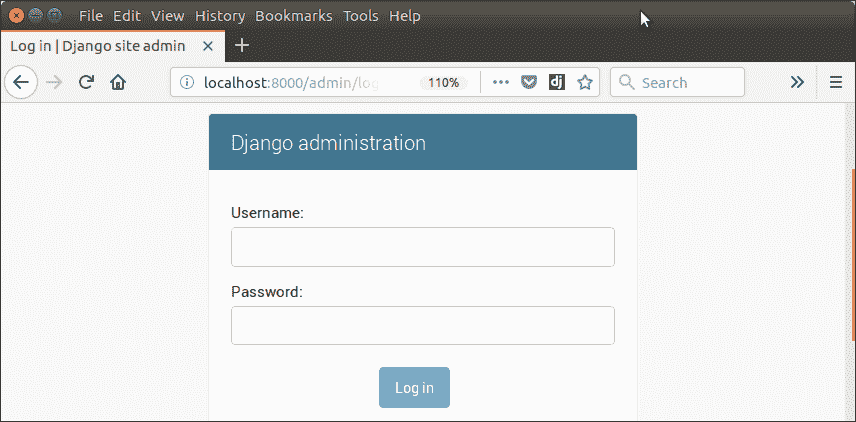
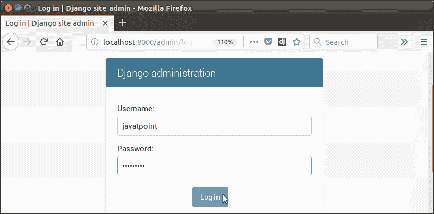
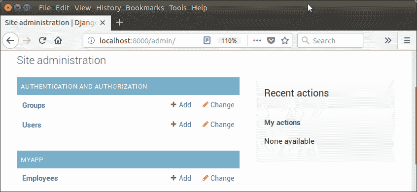
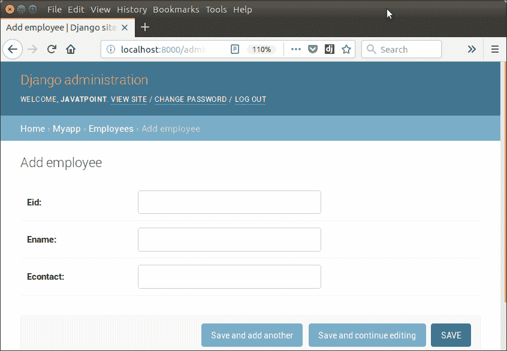
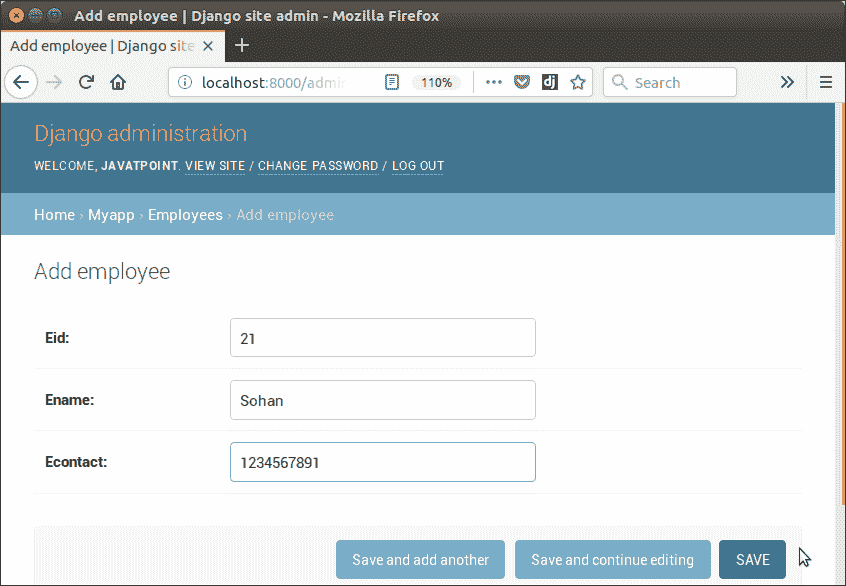
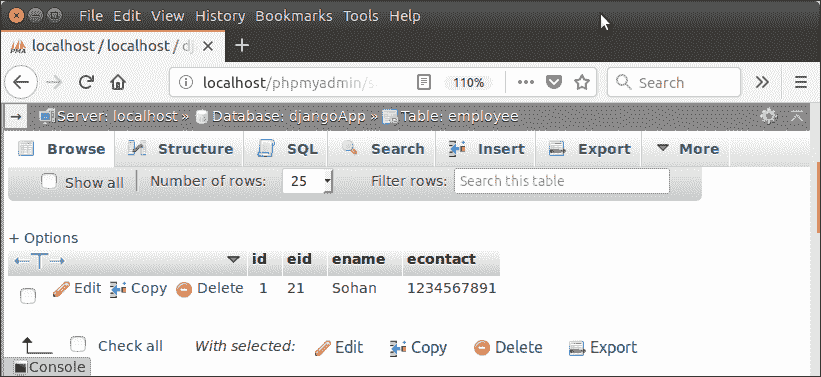

# Django 管理员

> 原文：<https://www.javatpoint.com/django-default-crud>

Django 提供了一个管理站点，允许对注册的应用模型进行 CRUD(创建、读取、更新、删除)操作。

它是 Django 的一个内置特性，可以自动为模型生成接口。

我们可以在 urls.py 文件中看到 admin 的 url 条目，它是隐式的，并且是在创建新项目时生成的。

```py

urlpatterns = [
    path('admin/', admin.site.urls),
]

```

从管理面板登录后可以轻松访问，让运行服务器**python 3 manage . py runserver**并通过 **localhost:8000/admin 访问。**

将显示登录表单，请参见下文。



要登录，首先创建 admin(超级用户)用户并提供密码，就像我们在这里做的那样:


超级用户创建成功，现在登录。



它显示成功登录后的主页，见下文。


这是一个管理仪表板，提供了创建组和用户等功能。它还用于管理模型。

## 注册 Django 模型

在**管理文件**中注册模型。使用**管理网站.注册()**方法并传递型号名称。请看例子。

**// admin.py**

```py

from django.contrib import admin
from myapp.models import Employee
admin.site.register(Employee) # Employee is registered

```

再次登录，看到里面有**员工**对象。



它提供自动生成的界面来创建新的模型对象。比如，如果我点击**添加，**它会呈现一个包含模型类中提供的所有属性的表单。

例如，我们的模型类包含以下代码。

**// models.py**

```py

from django.db import models
class Employee(models.Model):
    eid 	= models.CharField(max_length=20)
    ename 	= models.CharField(max_length=100)
    econtact = models.CharField(max_length=15)
    class Meta:
        db_table = "employee"

```

自动生成的表单将基于模型。我们不需要编写 HTML 来创建表单。该表单如下所示:



让我们通过提供详细信息并单击保存按钮来添加员工。



保存后，记录被存储到数据库表中，见下面的 MySQL 表。



使用这个管理仪表板，我们还可以更新和删除记录。