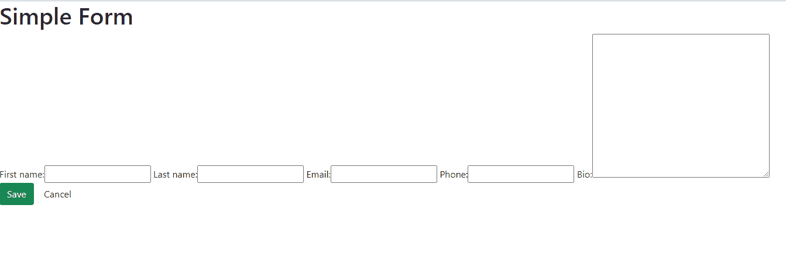
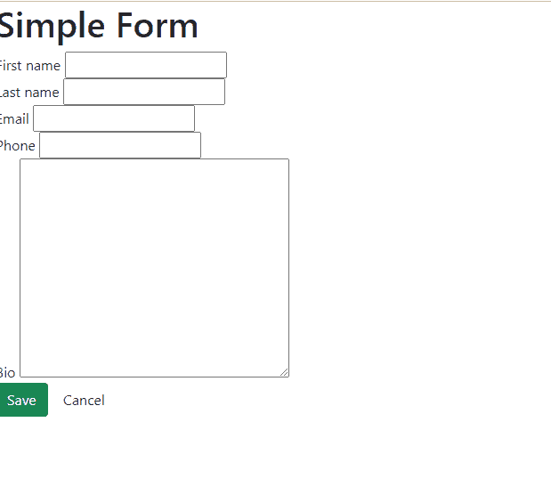
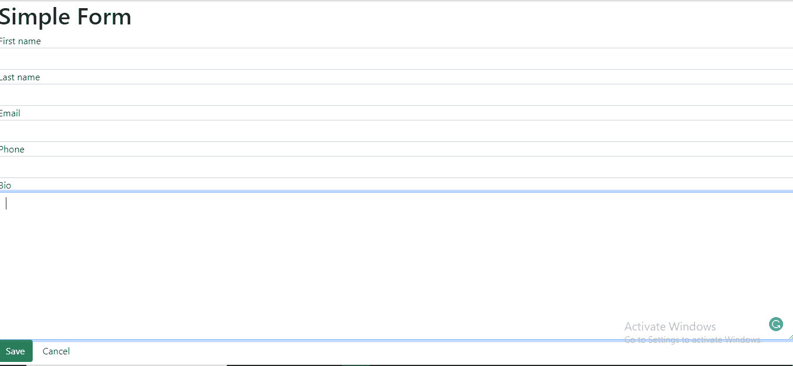
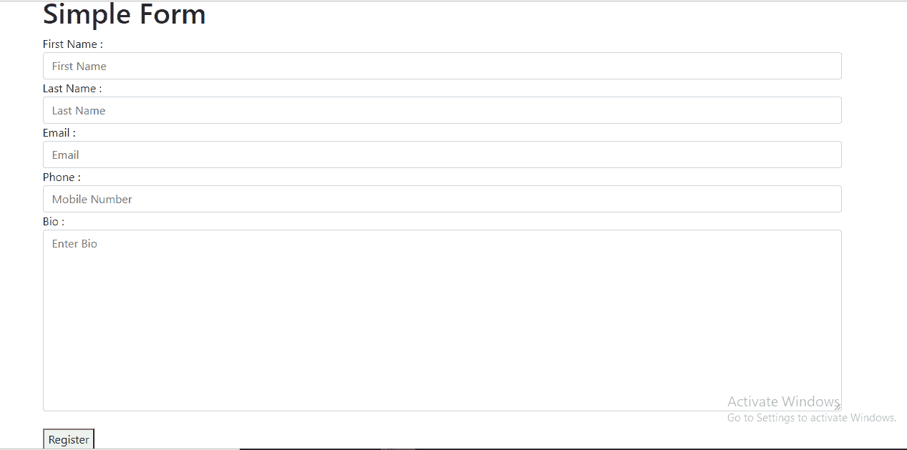

# 如何使用 Django 小工具来调整

> 原文：<https://www.javatpoint.com/how-to-use-django-widget-tweaks>

Django 提供了一种创建表单的简单方法。创建表单有多种方法，但是强烈建议使用 Django 内置表单。因为它将自动化大量的工作，并提供稳定和安全的功能。但是 Django 内置表单的问题是，它不允许我们轻松编辑表单以进行定制设计。

在本教程中，我们将看到定制 Django 表单的一种流行方法。我们将在表单的各个字段中包含自定义 CSS、类或 id。让我们看看为什么我们需要使用 Django 小部件调整。

## Django 内置表单有问题

在转向 Django 小部件调整包之前，我们将详细说明一下我们在 Django 内置表单中面临的一些问题。

我们使用引导类创建一个表单。让我们看看简单表单的代码。

```py

<form>
  <div class="form-group">
    <label for="id_email">Email address</label>
    <input type="email" class="form-control" id="id_email" name="email">
  </div>
  <div class="form-group">
    <label for="id_password">Password</label>
    <input type="password" class="form-control" id="id_password" name="password">
  </div>
  <button type="submit" class="btn btn-default">Submit</button>
</form>

```

这里我们设计了一个带有一些属性的简单表单，可以根据自己的需求添加更多。现在我们将在 model.py 文件中创建一个模型。

```py

from django.db import models

# Create your model here
class Profile(models.Model):
    first_name = models.CharField(max_length=30)
    last_name = models.CharField(max_length=30)
    email = models.EmailField(max_length=254)
    phone = models.CharField(max_length=20)
    bio = models.TextField(max_length=500)

    def __str__(self):
        return self.first_name

```

使用这个模型，我们创建了一个 Django 表单。创建一个 **forms.py** 文件，并添加以下代码。

**form.html**

```py

<!doctype html>
<html lang="en">
  <head>
    <!-- Required meta tags -->
    <meta charset="utf-8">
    <meta name="viewport" content="width=device-width, initial-scale=1">

    <!-- Bootstrap CSS -->
    <link href="https://cdn.jsdelivr.net/npm/bootstrap@5.1.0/dist/css/bootstrap.min.css" rel="stylesheet" integrity="sha384-KyZXEAg3QhqLMpG8r+8fhAXLRk2vvoC2f3B09zVXn8CA5QIVfZOJ3BCsw2P0p/We" crossorigin="anonymous">

    <title>Simple Form</title>
  </head>
  <body>
    <h1>Simple Form</h1>

<form method="post">
    
    {{ form }}
    <div class="form-group">
      <button type="submit" class="btn btn-success">
        <span class="glyphicon glyphicon-ok"></span> Save
      </button>
      <a href="" class="btn btn-default">Cancel</a>
    </div>
</form>

    <!-- Optional JavaScript; choose one of the two! -->

    <!-- Option 1: Bootstrap Bundle with Popper -->
    <script src="https://cdn.jsdelivr.net/npm/bootstrap@5.1.0/dist/js/bootstrap.bundle.min.js" integrity="sha384-U1DAWAznBHeqEIlVSCgzq+c9gqGAJn5c/t99JyeKa9xxaYpSvHU5awsuZVVFIhvj" crossorigin="anonymous"></script>

    <!-- Option 2: Separate Popper and Bootstrap JS -->
    <!--
    <script src="https://cdn.jsdelivr.net/npm/@popperjs/core@2.9.3/dist/umd/popper.min.js" integrity="sha384-eMNCOe7tC1doHpGoWe/6oMVemdAVTMs2xqW4mwXrXsW0L84Iytr2wi5v2QjrP/xp" crossorigin="anonymous"></script>
    <script src="https://cdn.jsdelivr.net/npm/bootstrap@5.1.0/dist/js/bootstrap.min.js" integrity="sha384-cn7l7gDp0eyniUwwAZgrzD06kc/tftFf19TOAs2zVinnD/C7E91j9yyk5//jjpt/" crossorigin="anonymous"></script>
    -->
  </body>
</html>

```

运行服务器并访问 http://127.0.0.1:8000/form/。



## 安装 Django 微调

为了定制 Django 内置表单，我们需要使用 Django 调整。我们使用以下命令进行安装。

```py

pip install django-widget-tweaks

```

一旦安装到系统中，将**小部件**添加到您的已安装应用中。

```py

# Application definition

INSTALLED_APPS = [
    'django.contrib.admin',
    'django.contrib.auth',
    'django.contrib.contenttypes',
    'django.contrib.sessions',
    'django.contrib.messages',
    'django.contrib.staticfiles',
    'MyWeatherApp',
    'widget_tweaks',
]

```

## 使用

在本节中，我们将展示该软件包提供的众多选项中的几个。如果你想了解全部，你可以参考它的官方文件。widget-twings 应用提供了两个集合，可以一起使用，也可以单独使用。

*   一个 **render_field** 模板标签，用于通过类似 HTML 的语法定制表单字段。
*   用于自定义表单域 HTML 属性和 CSS 类的几个模板过滤器。

**render_fields** 更容易使用，让设计人员和前端开发人员更容易进行字段定制。

但是，模板过滤器比 render_field 标记更强大。但是它们相当复杂，不太像 HTML 语法。

要开始使用它，我们必须在模板文件中加载以下标记。

```py



```

现在，通过迭代表单的字段来扩展表单，以便公开输入标签，替换它。

```py

{{form}}

```

由此

```py


  {{ hidden }}



  <div class="form-group">
    <label for="{{ field.id_for_label }}">{{ field.label }}</label>
    {{ field }}
    
      <span class="help-block">{{ error }}</span>
    

  </div>

<button type="submit" class="btn btn-success">
        <span class="glyphicon glyphicon-ok"></span> Save
      </button>
      <a href="" class="btn btn-default">Cancel</a>
</form>

```

**输出:**



如上面的代码所示，表单设计有所改进，但是我们的表单看起来不怎么样。

现在我们使用 django 调整，并向 field 元素添加额外的属性。



我们已经在每个 Django 表单字段中应用了引导类。我们将在 CSS 文件中包含所有代码，用于按类或 id 定制每个字段。

```py

 

```

让我们理解 render_field 的以下实现。



django-twings 包是定制表单域的强大工具。它帮助我们在每个领域应用引导类。所以我们必须用 CSS 设计 HTML，在 Django 中使用它，只需在最后用替换输入标签为 **render_field** 和 **form.field_name** ，然后用我们的选择进行设计。

* * *