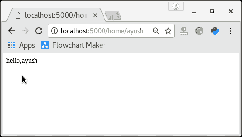
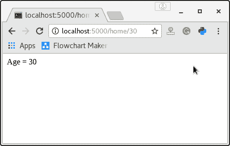
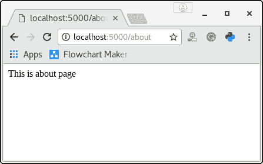

# Flask 应用路由

> 原文：<https://www.javatpoint.com/flask-app-routing>

应用路由用于将特定的网址与旨在执行某项任务的相关功能进行映射。它用于访问 web 应用中的某些特定页面，如[Flask 教程](flask-tutorial)。

在我们的第一个应用中，URL(“/”)与返回网页上显示的特定字符串的 home 函数相关联。

换句话说，我们可以说，如果我们访问映射到某个特定函数的特定网址，该函数的输出就会呈现在浏览器的屏幕上。

考虑下面的例子。

### 例子

```py

from flask import Flask
app = Flask(__name__)

@app.route('/home')
def home():
	return "hello, welcome to our website";

if __name__ =="__main__":
	app.run(debug = True)

```

Flask 便于我们使用<var-name>部分将变量部分添加到 URL 中。我们可以通过将变量作为参数添加到视图函数中来重用该变量。考虑下面的例子。</var-name>

### 例子

```py

from flask import Flask
app = Flask(__name__)

@app.route('/home/<name>')
def home(name):
	return "hello,"+name;

if __name__ =="__main__":
	app.run(debug = True)

```

它将在 web 浏览器上产生以下结果。



转换器也可以在 URL 中使用，将指定的变量映射到特定的数据类型。例如，我们可以分别提供年龄或工资等整数或浮点数。

考虑下面的例子。

### 例子

```py

from flask import Flask
app = Flask(__name__)

@app.route('/home/')
def home(age):
	return "Age = %d"%age;

if __name__ =="__main__":
	app.run(debug = True) 
```



以下转换器用于将默认字符串类型转换为关联的数据类型。

1.  字符串:默认
2.  int:用于将字符串转换为整数
3.  float:用于将字符串转换为 float。
4.  路径:它可以接受 URL 中给出的斜线。

## 函数的作用是

还有一种为 flask web 应用执行路由的方法，可以通过使用 flask 类的 add_url()函数来完成。下面给出了使用这个函数的语法。

```py

add_url_rule(, <endpoint>, <view function="">)</view></endpoint> 
```

这个函数主要用在视图函数没有给出的情况下，我们需要用这个函数把一个视图函数连接到外部的一个端点。

考虑下面的例子。

### 例子

```py

from flask import Flask
app = Flask(__name__)

def about():
	return "This is about page";

app.add_url_rule("/about","about",about)

if __name__ =="__main__":
	app.run(debug = True)

```



* * *