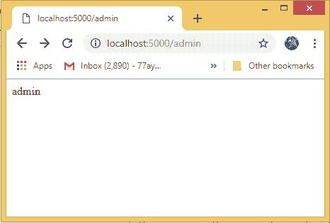

# Flask 网址构建

> 原文：<https://www.javatpoint.com/flask-url-building>

函数的作用是:动态地建立一个特定函数的网址。第一个参数是指定函数的名称，然后我们可以传递任意数量的关键字参数来对应 URL 的变量部分。

这个函数很有用，因为我们可以通过使用这个函数动态构建 URL 来避免将 URL 硬编码到模板中。

考虑下面的 python Flask 脚本。

### 例子

```py

from flask import *

app = Flask(__name__)

@app.route('/admin')
def admin():
    return 'admin'

@app.route('/librarion')
def librarion():
    return 'librarion'

@app.route('/student')
def student():
    return 'student'

@app.route('/user/<name>')
def user(name):
    if name == 'admin':
        return redirect(url_for('admin'))
    if name == 'librarion':
        return redirect(url_for('librarion'))
    if name == 'student':
        return redirect(url_for('student'))
if __name__ =='__main__':
    app.run(debug = True)

```

上面的脚本模拟了图书馆管理系统，可由三种类型的用户使用，即管理员、图书馆员和学生。有一个名为 user()的特定函数可以识别用户，并将用户重定向到包含该特定函数实现的确切函数。



例如，将 URL http://localhost:5000/user/admin 重定向到 URL http://localhost:5000/admin，将 URL localhost:5000/user/librarion 重定向到 URL http://localhost:5000/librarion，将 URL http://localhost:5000/user/student 重定向到 URL http://localhost/student。

## 动态网址构建的好处

1.  它避免了网址的硬编码。
2.  我们可以动态改变网址，而不是记住手动改变的硬编码网址。
3.  网址构建透明地处理特殊字符和 Unicode 数据的转义。
4.  生成的路径总是绝对的，避免了浏览器中相对路径的意外行为。
5.  如果您的应用位于 URL 根目录之外，例如，在/myapplication 而不是/中，则 url_for()会为您正确处理。

* * *