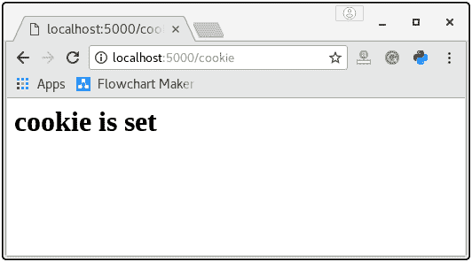
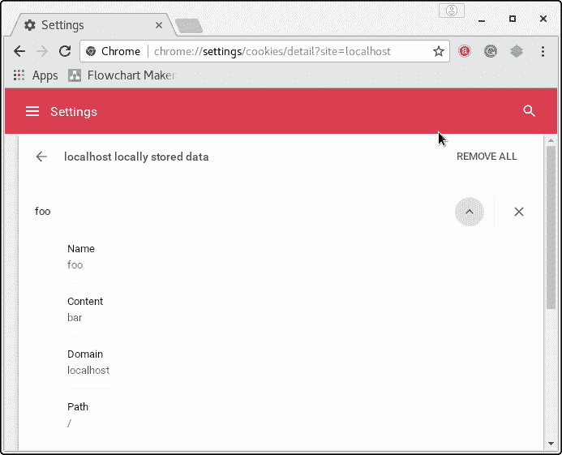
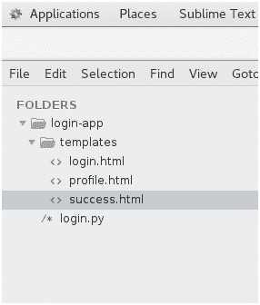
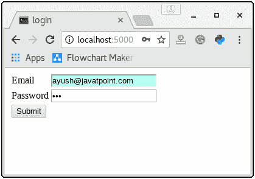
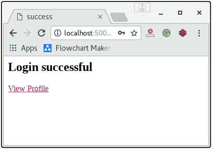
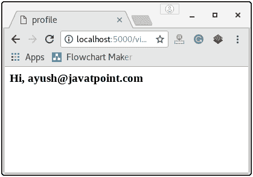

# Flask Cookie

> 原文：<https://www.javatpoint.com/flask-cookies>

cookies 以文本文件的形式存储在客户端机器上。Cookies 用于跟踪用户在网络上的活动，并根据用户的选择反映一些建议，以增强用户的体验。

cookie 是由客户端机器上的服务器设置的，在所有未来的事务中，它将与客户端对该特定服务器的请求相关联，直到 cookie 的生存期到期或被服务器上的特定网页删除。

在 flask 中，cookie 与请求对象相关联，请求对象是客户端传输的所有 cookie 变量及其值的字典对象。Flask 便于我们指定网站的到期时间、路径和域名。

```py

response.setCookie(<title>, <content>, <expiry time>)

```

在 Flask 中，通过在响应对象上使用 set_cookie()方法在响应对象上设置 cookie。可以使用视图函数中的 make_response()方法来形成响应对象。

此外，我们可以使用与 Request 对象关联的 cookies 属性的 get()方法读取存储在客户端机器上的 cookies。

```py

request.cookies.get(<title>)

```

下面给出了一个设置标题为“foo”内容为“bar”的 cookie 的简单示例。

### 例子

```py

from flask import *

app = Flask(__name__)

@app.route('/cookie')
def cookie():
	res = make_response("cookie 已设置")
	res.set_cookie('foo','bar')
	return res

if __name__ == '__main__':
	app.run(debug = True)

```

以上 python 脚本可以用来为网站 **localhost:5000** 设置浏览器上名称为‘foo’内容为‘bar’的 cookie。

使用命令 python script.py 运行这个 python 脚本，并在浏览器上检查结果。



我们可以在浏览器的内容设置中跟踪 cookie 的详细信息，如下图所示。



## Flask 中的登录应用

这里，我们将在 Flask 中创建一个登录应用，其中向用户显示一个登录页面(login.html)，提示用户输入电子邮件和密码。如果密码是“jtp”，那么应用将把用户重定向到成功页面(success.html)，在那里给出消息和到配置文件的链接(profile.html)，否则它将把用户重定向到错误页面。

控制器 python flask 脚本(login.py)控制应用的行为。它包含各种情况下的视图功能。用户的电子邮件以 cookie 的形式存储在浏览器中。如果用户输入的密码是“jtp”，那么应用会将用户的电子邮件 id 作为 cookie 存储在浏览器上，稍后会在配置文件页面中读取该 cookie 以向用户显示一些消息。

该应用包含以下 python 和 HTML 脚本。应用的目录结构如下所示。



**登录。py**

```py

from flask import *

app = Flask(__name__)

@app.route('/error')
def error():
	return "**输入正确的密码**"

@app.route('/')
def login():
	return render_template("login.html")

@app.route('/success',methods = ['POST'])
def success():
	if request.method == "POST":
		email = request.form['email']
		password = request.form['pass']

	if password=="jtp":
		resp = make_response(render_template('success.html'))
		resp.set_cookie('email',email)
		return resp
	else:
		return redirect(url_for('error'))

@app.route('/viewprofile')
def profile():
	email = request.cookies.get('email')
	resp = make_response(render_template('profile.html',name = email))
	return resp

if __name__ == "__main__":
	app.run(debug = True)

```

登录. html

```py

	login

| 电子邮件 | <input type="email" name="email"> |
| 密码 | <input type="password" name="pass"> |
| <input type="submit" value="Submit"> |

```

**success.html**

```py

success

	登录成功
	View Profile

```

**profile.html**

```py

	profile

	嗨，{{name}}

```

## 执行

使用命令 python login.py 运行 python 脚本，并访问浏览器上的 localhost:5000/如下快照所示。



单击提交。它将展示成功的信息，并提供到 profile.html 的链接。



单击查看配置文件。它将从浏览器中读取 cookie 集作为响应，并显示以下消息。



* * *