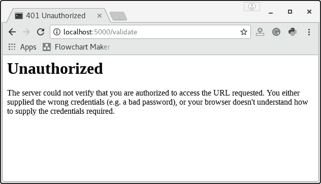

# Flask 重定向和错误

> 原文：<https://www.javatpoint.com/flask-redirect-and-errors>

Flask 类提供了重定向()函数，该函数将用户重定向到具有指定状态代码的指定网址。

HTTP 状态代码是服务器对浏览器请求的响应。当我们访问一个网站时，一个请求被发送到服务器，然后服务器用一个三位数的代码来响应浏览器的请求:HTTP 状态代码。该状态代码也表示错误。

下面给出了使用重定向()函数的语法。

```py

Flask.redirect(<location>,<status-code>, <response> )

```

它接受以下参数。

| 塞内加尔 | 参数 | 描述 |
| one | 位置 | 它是响应将被重定向到的网址。 |
| Two | 状态代码 | 它是与服务器响应一起发送到浏览器头部的状态代码。 |
| three | 反应 | 它是项目中用于未来需求的响应实例。 |

考虑以下示例，其中用户被重定向到成功页面，否则在成功登录时 HTTP 状态代码为 302(已找到)；用户仅返回到此页面。

### 例子

**登录。py**

```py

from flask import *
app = Flask(__name__)

@app.route('/')
def home ():
	return render_template("home.html")

@app.route('/login')
def login():
	return render_template("login.html");

@app.route('/validate', methods = ["POST"])
def validate():
	if request.method == 'POST' and request.form['pass'] == 'jtp':
		return redirect(url_for("success"))
	return redirect(url_for("login"))

@app.route('/success')
def success():
	return "logged in successfully"

if __name__ == '__main__':
	app.run(debug = True)

```

**home.html**

```py

home

欢迎来到网站
login

```

登录. html

```py

	login

| 电子邮件 | <input type="email" name="email"> |
| 密码 | <input type="password" name="pass"> |
| <input type="submit" value="Submit"> |

```

在上面的示例中，URL“/”包含一个指向登录页面的链接，如下图所示。


登录页面包含如下图所示的提示用户输入电子邮件和密码，提交按钮将用户重定向到 URL /validate。


在这种情况下，由于我输入了一个不等于“jtp”的随机密码，因此用户只能返回到这个页面(登录页面)。

但是，只有当用户输入的密码为“ **jtp** 时，用户才会被重定向到网址/ **成功**。网址 http://localhost:5000/success(成功登录时生成)如下图所示。


## 标准超文本传输协议代码

以下 HTTP 代码是标准化的。

*   HTTP_300_MULTIPLE_CHOICES
*   HTTP _ 301 _ MOVED _ PERMANENTLY
*   HTTP_302_FOUND
*   HTTP_303_SEE_OTHER
*   HTTP _ 304 _ 未修改
*   HTTP_305_USE_PROXY
*   HTTP_306_RESERVED
*   HTTP _ 307 _ TEMPORARY _ REDIRECT

默认状态代码是 HTTP_302_FOUND。

## abort()函数

abort()函数用于处理来自客户端的请求中包含错误的情况，例如错误请求、未经授权的访问等。然而，错误代码是由于发生错误而被提及的。

下面给出了使用 abort()函数的语法。

```py

Flask.abort(code)

```

根据指定的错误，我们可以提及以下错误代码。

*   400:用于错误请求
*   401:未经授权的访问
*   403:禁止
*   404:找不到
*   不可接受
*   415:对于不支持的媒体类型
*   429:请求太多

让我们修改上面示例中的脚本 login.py，并在用户输入任何随机密码的情况下使用带有错误代码 401(用于未经授权的访问)的 abort()函数。

### 例子

```py

from flask import *
app = Flask(__name__)

@app.route('/')
def home ():
	return render_template("home.html")

@app.route('/login')
def login():
	return render_template("login.html");

@app.route('/validate', methods = ["POST"])
def validate():
	if request.method == 'POST' and request.form['pass'] == 'jtp':
		return redirect(url_for("success"))
	else:
		abort(401)

@app.route('/success')
def success():
	return "logged in successfully"

if __name__ == '__main__':
	app.run(debug = True)

```

如果密码错误，它将产生以下结果。



这里，我们使用了错误代码 401，因为用户请求了对资源的未授权访问。我们可以根据错误情况将其更改为任何代码。

* * *