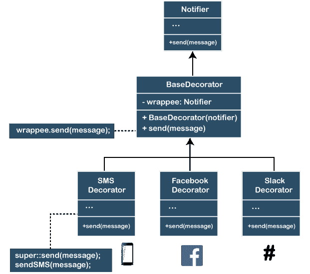

# 观察者设计模式

> 原文：<https://www.javatpoint.com/observer-design-pattern-in-python>

观察者设计模式是一种行为设计模式，其中对象被表示为等待事件触发的观察者。当新事件被触发时，多个观察者捕捉这些事件。

事件源(或对象)附加到主题。每当在对象中执行改变时，观察者都会通知它。它遵循对象之间的**一对多**方法，因此主题中的一个变化将反映在其所有从属对象中，并自动更新。

让我们用现实世界的例子来理解上面的概念。

如果我们是报纸或杂志订阅者，我们不需要去商店获取新闻。我们在家买报纸。如果有新的更新可用，发布者会在发布后立即将其直接发送到我们的邮箱。

发布者拥有关于订阅者的完整信息。如果与他们的兴趣不匹配，订户可以停止发布者的服务。

## 不使用观察者设计模式的问题

假设客户对尚未推出的特定产品(假设是新手机)感兴趣。但是，它将很快在商店中提供，以便客户可以定期访问商店并检查可用性。但是这些访问毫无意义，因为产品还在路上。

商店可以不这样做，而是发送几封电子邮件，但这会困扰那些对新产品不感兴趣的人。

这里出现了两个问题:要么客户浪费时间检查产品的可用性，要么电子邮件可能会通知错误的客户。

## 用观察法解决

包含一些有趣信息的对象被表示为主体。它通知其他对象改变到它的状态被称为 ***发布者。*** 所有其他想要跟踪发布者状态变化的对象都被称为 ***订阅者。***

在观察者方法中，发布者类由 subscription 方法组成，这样每个对象都可以订阅和取消订阅该发布者正在发生的事件。这个机制可能看起来有点难，但并不像听起来那么复杂。发布者-订阅者机制由以下方法组成。

*   订阅者对象的引用列表。
*   各种公共方法提供了在列表中添加和删除订户的功能。

在 observer 方法的帮助下，每当发布服务器发生任何事件时，它都会直接传递给订阅服务器，并在它们的对象上调用确切的通知方法。

一个应用可能有几个订阅者类愿意跟踪来自同一个发布者类的事件。但是发布者不能附加到所有这些订阅者类。

所有订阅者和发布者都实现了一个公共接口，以便使用该接口与订阅者进行通信。接口应该声明通知方法，并且该方法包含发布者可以用来随通知传递一些数据的参数集。

我们可以修改接口，使所有订阅者与不同类型的发布者兼容。我们只需要指定几个订阅方法。



## 观察者设计模式的实现

让我们理解下面的代码片段。

**示例-**

```py

import threading
import time
import pdb

class Downloader_Class(threading.Thread):

    def run(self):
        print('Current Task Downloading')
        for i in range(1, 6):
            self.i = i
            time.sleep(2)

        return 'hello world'

class Working_Class(threading.Thread):
    def run(self):
        for i in range(1, 6):
            print('Working_Class running: %i (%i)' % (i, dow.i))
            time.sleep(1)
            dow.join()

            print('Task Completed')

dow = Downloader_Class()
dow.start()

time.sleep(1)

wor = Working_Class()
wor.start()

wor1 = Working_Class()
wor1.start()

t3 = Working_Class()
t3.start()

```

**输出:**

```py
Current Task Downloading
Working_Class running: 1 (1)
Working_Class running: 1 (1)
Working_Class running: 1 (1)
Task CompletedTask CompletedTask Completed
Working_Class running: 2 (5)
Working_Class running: 2 (5)
Working_Class running: 2 (5)
Task Completed
Task Completed
Working_Class running: 3 (5)
Task Completed
Working_Class running: 3 (5)
Working_Class running: 3 (5)
Task CompletedTask Completed

Working_Class running: 4 (5)Working_Class running: 4 (5)Task Completed

Working_Class running: 4 (5)
Task CompletedTask Completed
Working_Class running: 5 (5)

Working_Class running: 5 (5)
Task Completed
Working_Class running: 5 (5)
Task Completed
Task Completed
Task Completed

```

**解释-**

在上面的代码中，我们解释了下载结果的方式，其中每个对象都被视为观察者。

## 观察者设计模式的优势

以下是观察者设计模式的一些优点。

*   在运行时设置对象之间的关系非常灵活。
*   在 Open/Closed 原则的帮助下，我们可以引入新的订阅者类，而无需更改发布者的代码。
*   这种方法仔细描述了对象和观察者之间存在的耦合。

## 观察者设计模式的缺点

以下是观察者设计模式的一些缺点。

*   观察者方法有实现的风险。如果不小心实现，就会造成代码复杂度大。
*   观察者设计模式的主要缺点是以随机顺序通知用户。
*   由于观察器的显式注册和取消注册，在观察器设计模式中还存在内存泄漏问题。

## 适应性

*   如果一个对象的状态有多个依赖项，则应该使用 observer 方法。它遵循一对多的依赖关系，这意味着对象状态的任何变化都将反映附加的对象(在松散耦合的情况下)。
*   此方法用于发送通知、电子邮件、消息等。当我们订阅任何特定网站时，我们会通知您该网站上的任何新活动。
*   对象应该紧密耦合。如果对象之间存在松散耦合，那么一种状态的变化将反映在另一种对象中。
*   订户列表是动态的，这意味着订户可以在需要时加入和退出订阅。

* * *